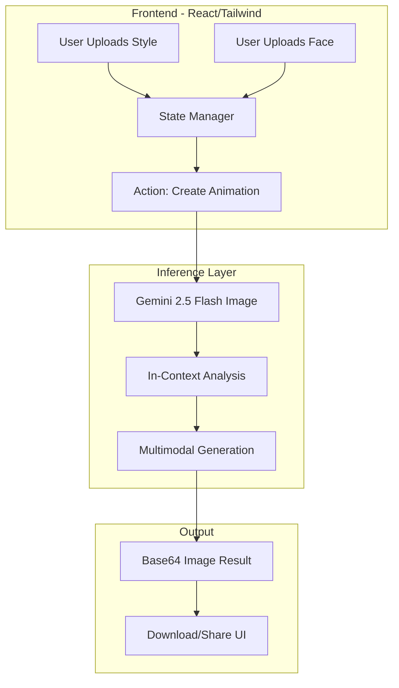

# MagicFace: Child Illustration Personalizer Prototype

MagicFace is an end-to-end prototype designed to personalize 3D-styled illustrations using a child's photo. By leveraging the latest in multimodal generative AI, it maintains artistic style while injecting the identity and gender of the user-uploaded subject.

## 🏗️ Architecture Diagram

The system follows a classic client-server model optimized for serverless AI inference.

## 🧠 Technical Choices

### Model Choice: Gemini 2.5 Flash Image
For this prototype, we selected **Gemini 2.5 Flash Image** over traditional Stable Diffusion pipelines (like Instant-ID or ControlNet).
- **Reasoning:** Traditional pipelines often require complex multi-step setups (Face ID extraction -> ControlNet conditioning -> SDXL diffusion). Gemini 2.5 Flash handles **native multimodal input**. It can "see" the style reference and the face reference in a single context window, allowing for better semantic reasoning (e.g., automatically changing the character's clothing based on the identified gender in the photo).
- **Performance:** As a "Flash" model, it offers the high-speed inference necessary for a snappy web user experience.

### Limitations
1. **Identity Precision:** While Gemini is excellent at "loose likeness" and general features, it doesn't perform 1:1 biometric facial reconstruction. The resulting character looks *like* the child but is a stylized interpretation.
2. **Context Adherence:** Occasionally, the model might over-prioritize the style reference's features (e.g., keeping the hair color of the style reference instead of the child's) if not prompted precisely.
3. **Single Aspect Ratio:** The prototype currently targets a 1:1 square ratio for consistency across social sharing platforms.

## 🚀 Roadmap: What's next for V2?

If we were to move this from a prototype to a production-grade application, the following improvements would be prioritized:

1. **Instant-ID Integration:** Move to a dedicated Stable Diffusion pipeline using **Instant-ID** for strict identity preservation, ensuring the 3D character is unmistakably the specific child.
2. **Face Geometry Extraction:** Implement a pre-processing step using MediaPipe or Dlib to extract specific facial landmarks (nose shape, eye distance) and pass them as structured metadata to the AI.
3. **Custom Style Library:** Instead of just one reference image, allow users to choose from a curated library of "Worlds" (e.g., Claymation, Watercolor, Sci-Fi) powered by LoRA (Low-Rank Adaptation) models.
4. **Video Animation:** Use the generated character as a seed for **Veo** or **SVD (Stable Video Diffusion)** to create a 5-second animated clip of the character waving or smiling.
5. **Background Personalization:** Use the `googleSearch` tool in Gemini to find relevant background elements based on a user's prompt (e.g., "put them in a park in London") to further ground the character in a real or fantasy context.

---
*Created as a technical prototype for personalized AI illustration.*